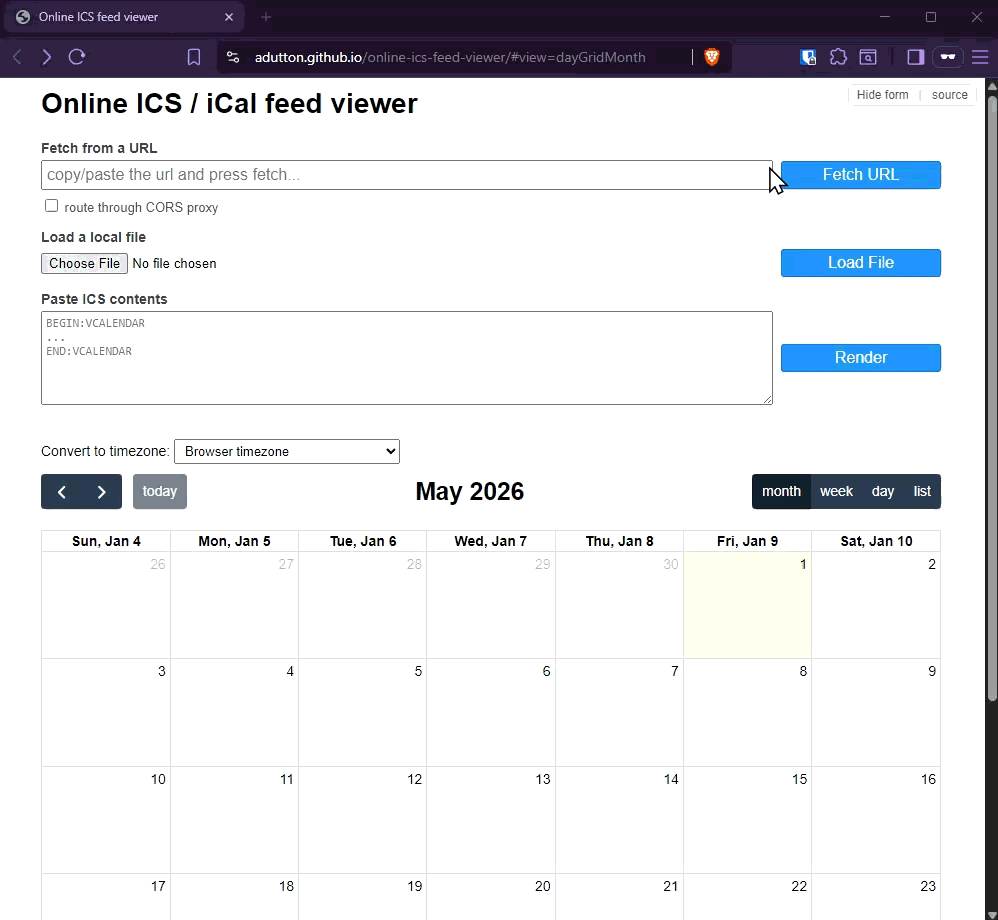

# Online ICS feed viewer
[Online demo](https://adutton.github.io/online-ics-feed-viewer/)



You can use this tool to either view quickly the contents of an ICS file, or an online feed, or to make a public ICS feed or local file viewable through a URL.

State is stored in the URL hash, so a configured viewer can be shared as a link.

Sibling project to [online-openapi-viewer](https://github.com/adutton/online-openapi-viewer).

## Example feeds

- [US Holidays (Calendar Labs)](https://ics.calendarlabs.com/76/0d86dd9d/US_Holidays.ics)
- [Bundled `sample.ics`](./sample.ics) (a snapshot of the above, served alongside the viewer)

## Example paste

A minimal recurring event you can paste straight into the "Paste ICS contents" box:

```
BEGIN:VCALENDAR
VERSION:2.0
PRODID:-//Example//Family Dinner//EN
BEGIN:VEVENT
UID:family-dinner@example.com
DTSTAMP:20260101T000000Z
DTSTART:20260108T010000Z
DTEND:20260108T023000Z
RRULE:FREQ=WEEKLY;BYDAY=WE
SUMMARY:Family Dinner
END:VEVENT
END:VCALENDAR
```

## Hash parameters

- `feed` - remote ICS feed URL
- `file` - base64-encoded local file contents (only used for small files; larger files are rendered locally but not encoded into the share URL)
- `cors` - `true`/`false`, route the URL through a public CORS proxy without trying a direct fetch first
- `title` - page heading
- `view` - FullCalendar view name (`dayGridMonth`, `timeGridWeek`, `timeGridDay`, `listMonth`)
- `startdate` - initial date for the calendar
- `tz` - IANA timezone to convert events to (e.g. `America/New_York`)

## Privacy

When the CORS proxy is used (either explicitly via the checkbox / `cors=true`, or automatically as a fallback when a direct fetch is blocked), the feed URL is sent through [api.allorigins.win](https://allorigins.win) — a third-party service. Don't enable the proxy for URLs you don't want exposed to it.

## Why
I can't believe this doesn't exist... I just want this, nothing more. I just don't want to download / import to view something online.

Time it took to make, aka combine two [existing](https://fullcalendar.io/) [javascript](https://github.com/mozilla-comm/ical.js) libraries: 2h.

Result: something super useful if you need it. If you need feature-x or it doesn't works, just open an [issue](https://github.com/adutton/online-ics-feed-viewer/issues).

## License

[MIT](./LICENSE.md).
